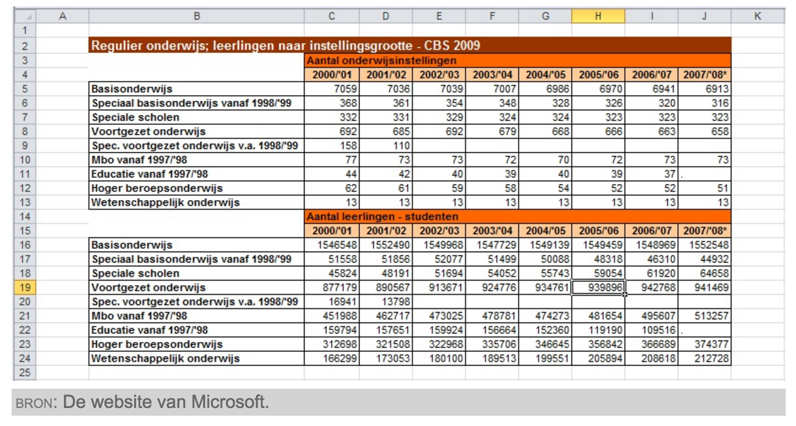

# PXKETEN-283 Attributen worden genegeerd

- Het extra attribuut `machtsfuncties_als_1_macht` zorgt ervoor dat het antwoord van `2^3 * 2^4` wordt
  gerenderd als `2^7` ipv `128`. Dat laatste verschijnt zonder dat attribuut. 
- Het attribuut wordt dus correct doorgespeeld van auteurstool
- Het attribuut wordt dus correct opgepikt door de algebrakit app
- Het attribuut dwingt niet de notatie af, dus zowel 2^7 als 128 worden goed gerekend; het tussenantwoord
  `2*2^6` wordt alleen als tussenstap goed gerekend (oranje √-teken). Eindnotatie wordt dus wel gecontrolleerd.
- Dit laatste kan alleen in Algebrakit veranderd wordem: Even doorgespeeld aan Martijn Slob.

# PXKETEN-297 Opslaan content lukt niet.......

- Deze paragrafen staan zover ik kan zien allemaal aangemerkt als onbewerkbaar. Ik krijg i.i.g. onder 
alle pagina's de melding "Het is niet meer mogelijk deze paragraaf te bewerken via de auteurstool. 
Indien u toch nog een wijziging wilt (laten) uitvoeren, neem dan contact op met supportteam@sanoma.com." 
Als dit niet klopt graag laten weten, dan moet ook de status "productie_gereed" als toch editable 
aangemerkt worden in lockstatus in m4a_editor.xslt. (Laatste even als memo voor mezelf als we 
hier op terug moeten komen).

- Graag URL van probleem pagina ipv van hoofdstuk volgende keer (geldt voor alle issues)

# PXKETEN-310 combinatie syntax ondersteuning in algebraKIT testveld

- Notatie compacter (zonder extra accolades) in te voeren als <code>n\choose&#x2423;k</code>
- Algebrakit issue: 500 Internal Server Error op request aan Algebrakit server. Doorgespeeld aan Martijn 
  op dit moment.
- Zelfde als **PXKKETEN-318**

# PXKETEN-198 "Edit Image” venster; cursor springt steeds het eind van het pad

- Bug in TinyMCE ( zie http://www.tinymce.com/develop/bugtracker_view.php?id=7608 )
- Upgrade TinyMCE naar versie 4.2.6 verhelpt probleem
- Gebruikers moeten cache leegmaken

# PXKETEN-63 Bron class wordt verwijdert door de auteurstool

- Op dit moment verwijderd de XSLT transformatie van XML naar HTML de 'class' attributen weg (alle attributen worden weggegooid trouwens op 
)
- Class attributen worden in HTML gebruikt voor visuele representaties, dus is "reserved keyword", die de 
  tool af en toe gebruikt en dus niet bidirectioneel gebruikt kan worden.
- TinyMCE, de editor, zou de class niet begrijpen of verstoren.
- Je krijgt een mix van visualisatie en content in je XML
- Mogelijke oplossingen:
    1. Vertaal class attributen op 
-elementen. Heeft niet mijn voorkeur vanwege bovenstaande elementen.    
    2. Vertaal class element alleen als class="bron". Daarmee geef je eigenlijk al aan dat de bron 
       niet zozeer een paragraaf is maar een appart stuk content, dus dan kom je bij mijn voorstel:        
    3. Introduceer een \<bron\> element in de XML. Dit wordt een \
\</div\> element in de
       auteurstool. 
        - Omdat TinyMCE deze niet herkent, is dit element automatisch niet-editable, wat het ook niet
          zou moeten zijn als dit alleen in XML correct kan worden ingevoegd
        - TinyMCE kan een extra pluging krijgen, zoals reeds met de trefwoord en cloze is gebeurd; dit
          zal ik doen als dit in apparte PXKETEN wordt gevraagd (en jullie XML hebben afgestemd).
        - in CSS is de div met \[tag="bron"\] van uiterlijk te verandeeren.
- Oplossing 3 heb ik reeds geïmplementeeerd, maar dan zouden ook andere tools aangepast moeten worden. Kiezen
  jullie late voor 2 kan ik nog in de XSLT transformatie zorgen dat dat pad hetzelfde werkt als 3.

- Voorgestelde XML

        <bron>De website van Microsoft</bron>

- Voorgestelde CSS

        div[tag='bron'] {
            background-color: lightgrey;
            color: #666;
        }
        
        div[tag='bron']::before {
            content: 'bron: ';
            font-variant: small-caps;
            color: #777;
            padding-left: .5ex;
        }

- Geeft deze rendering:
    

# PXKETEN-107 Guideline DO's en DONT's voor folders en files op server

- Werkdirectory van auteurstool is alleen voor auteurstool
- Alle communicatie via Subversion
- Als er tools draaien op de server: sla alle files die niet via svn gecommit worden buiten de werkdirectory op.
- Tools die files veranderen die in subversion staan:
    - dienen deze takken zelf te updaten en te committen
    - De svn-boom mag niet in een gebroken staat achter worden gelaten door deze tools
    - De commit moet worden gedaan met een message (-m) met daarin de naam en pad van het tool
    - Geen files met de uitgang .xml
- Als er files zijn in SVN die niet door tool worden geüpdatet en gecommit (e.g. geogebra files), a.u.b.
  laten weten of deze net als plaatjes door tool moeten worden toegevoegd.
